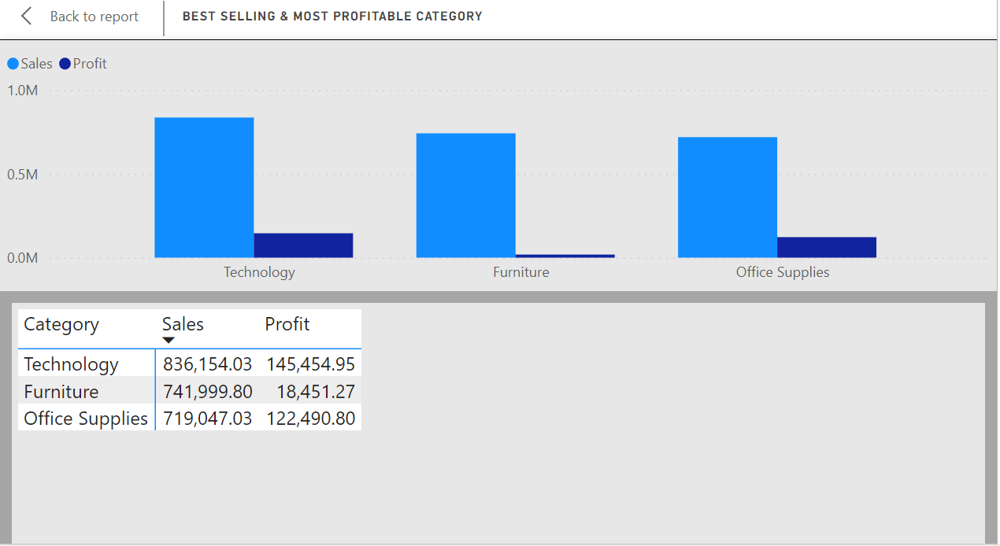
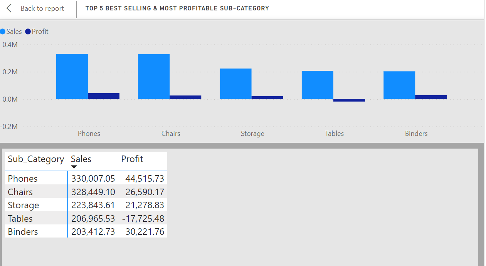
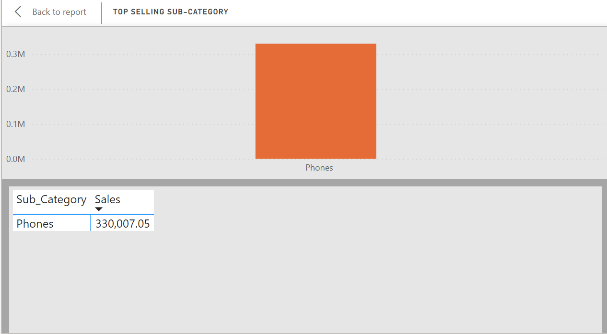
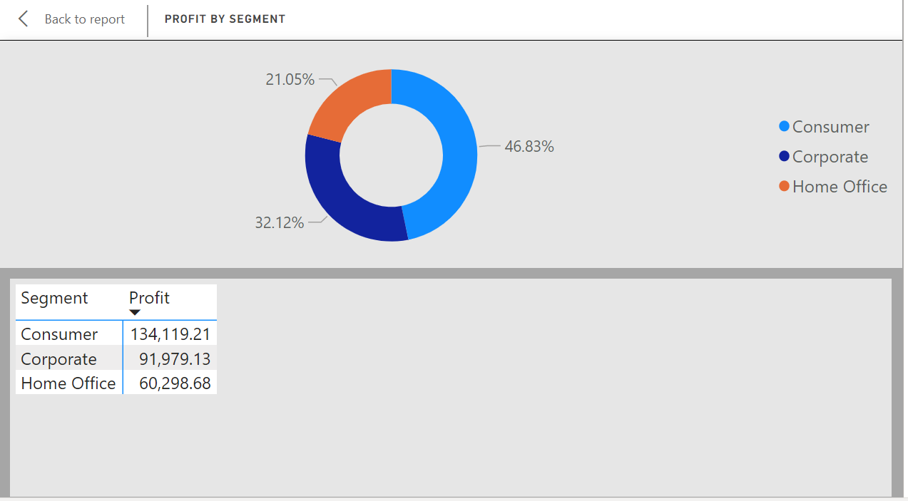
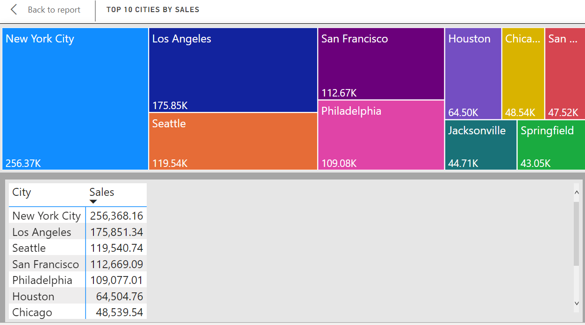

# Nifest Supermart Analysis 

## Introduction

This is a Power BI and SQL project on sales analysis of an imagenary store called **Nifest Supermart**
The project is about driving insights to answer crucial questions and help the store make data driven decisions. 

**_Disclaimer_**: All the dataset do not represent the data of any real company, institution or country. 

## Problem Statement 
1. Which Category is Best Selling and Most Profitable?
2. What are the Best Selling and Most Profitable Sub-Category?
3. Which is the Top Selling Sub-Category?
4. Which Customer Segment is Most Profitable?
5. Which is the Preferred Ship Mode?
6. Which Region is the Most Profitable?
7. Which City has the Highest Number of Sales?

## Skills and Concept Demonstrated

The following Power BI and SQL features/functions were incorporated: 
- Round, 
- Group By, 
- Order By, 
- Filters, 
- Quick Measures

## Visualized Solution
1. **Which Category is Best Selling and Most Profitable?**

2. **What are the Best Selling and Most Profitable Sub-Category?**

3. **Which is the Top Selling Sub-Category?**

4. **Which Customer Segment is Most Profitable?**

5. **Which is the Preferred Ship Mode?**

6. **Which Region is the Most Profitable?**

7. **Which City has the Highest Number of Sales?**

